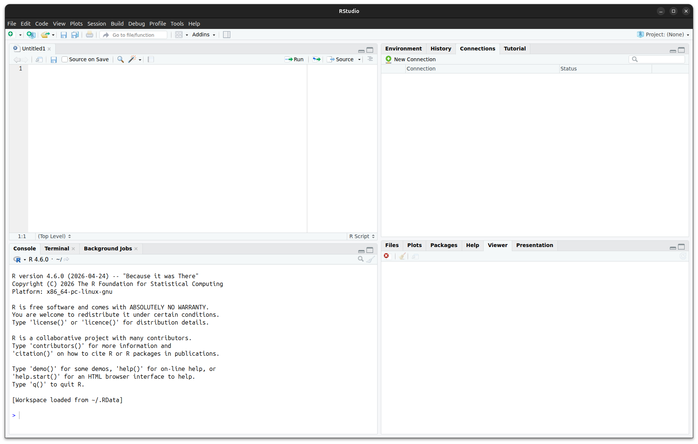

```{r}
#| label: setup
#| include: false

required_packages <- c(
  "remotes", "ggplot2", "resemble",
  "prospectr", "matrixStats", "kableExtra"
)

missing <- required_packages[!sapply(required_packages, requireNamespace, quietly = TRUE)]
if (length(missing) > 0) install.packages(missing)


library(proximetricsR)
library(remotes)
library(ggplot2)
library(prospectr)
library(matrixStats)


knitr::opts_chunk$set(
  echo = TRUE,
  eval = TRUE,
  message = FALSE,
  warning = FALSE, 
  fig.align = 'center'
)
options(cli.num_colors = 1)
Sys.setenv("RSTUDIO" = "")
Sys.setenv("POSITRON" = "")
old_options <- options(digits = 3)
```


<br>
<br>


# Session 1 {background-color="#000000"}


## Introduction

$$
\text{y} = {\color{red} f}(\text{DRS spectrum}) + \epsilon
$$

::: {.incremental}


:::

## Introduction
. . .

> DRS **complements**, does not replace, laboratory analyses [@viscarra2022diffuse]

. . .

::: {.callout-warning}
Developing reliable DRS models is itself **costly and time-consuming**, a limitation rarely acknowledged in the literature [@RamirezLopez2026Liblex]

:::


## What are we trying to do? {background-color="#000000"}

$$\text{y} = {\color{red} f}({\color{dodgerblue} g}(\text{DRS spectrum})) + \epsilon$$ 


::: {.fragment}
- ${\color{dodgerblue} g}$: signal processing, e.g derivatives, scatter correction, normalisation  

- ${\color{red} f}$: chemometric model, e.g. regression, classification, local methods

- $\epsilon$: irreducible error
:::

::: {.fragment}
These are distinct, composable steps.
:::


## What are we trying to do?

A simplified view of the chemometric modelling pipeline:

```{r}
#| echo: false
#| eval: true
#| fig-align: center
library(DiagrammeR)

grViz("
digraph pipeline {
  graph [rankdir=LR, bgcolor=transparent]
  node [shape=box, style=filled, fillcolor='#F5F5F5', fontname=Helvetica, fontsize=14]
  
  A [label='Raw training\\ndata']
  B [label='Data\\nwrangling']
  C [label=<<I>g</I><BR/>(preprocessing<BR/>combinations)>, fillcolor='#CCEEFF']
  D [label=<<I>f</I><BR/>(modelling<BR/>approaches)>, fillcolor='#FFD9D9']
  E [label='Validate', fillcolor='#DDFFDD']
  
  { rank=same; D; E }
  
  A -> B -> C -> D
  D -> E [style=dashed, color='#999999']
  E -> C [constraint=false, style=dashed, color='#999999',
          label='  iterate', fontname=Helvetica, fontsize=11, fontcolor='#999999']
}
")
```


## What are we trying to do?


A simplified view of the prediction pipeline:


```{r}
#| echo: false
#| eval: true
#| fig-align: center
library(DiagrammeR)
grViz("
digraph pipeline {
  graph [rankdir=LR, bgcolor=transparent]
  node [shape=box, style=filled, fillcolor='#F5F5F5', fontname=Helvetica, fontsize=14]
  A [label='Raw\\nspectrum']
  B [label=<<I>g</I><BR/>(signal processing)>, fillcolor='#CCEEFF']
  C [label='Preprocessed\\nspectrum']
  D [label=<<I>f</I><BR/>(model)>, fillcolor='#FFD9D9']
  E [label='ŷ']
  A -> B -> C -> D -> E
}
")
```

## Why open-source chemometrics? [1/4] {background-color="#000000"}

Proprietary chemometrics software...


<br>

**Cost and access**

::: {.incremental}
- Licence fees

- Institutional dependency

- Risk of discontinuation

- Limited user base → limited community support

:::

## Why open-source chemometrics? [2/4] {background-color="#000000"}

Proprietary chemometrics software...

<br> 

**Transparency and trust** 


::: {.incremental}

- Closed source

- Bugs hard to spot or report

- Reproducibility limited

- No audit trail

- Less amenable to peer scrutiny
:::

## Why open-source chemometrics? [3/4] {background-color="#000000"}

Proprietary chemometrics software...

<br> 

**Flexibility and integration**

::: {.incremental}   

- Poor interoperability

- No version control

- Cannot script end-to-end pipelines

- Disconnected from modern AI/ML tools

- Model deployment requires additional licences

- Slow response time to new developments
:::


## Why open-source chemometrics? [4/4] {background-color="#000000"}

<br>

```{r}
#| echo: false
#| eval: true
library(knitr)

comparison_tbl <- data.frame(
  Aspect = c("Cost", "Source", "Reproducibility", "AI/ML integration", "Customisation", "Community", "Longevity"),
  Proprietary = c(
    "Licence required",
    "Closed",
    "Limited",
    "Restricted",
    "Little",
    "Small",
    "Uncertain"
  ),
  "Open source (e.g. R)" = c(
    "Free",
    "Open",
    "Full scripting",
    "Native",
    "Unlimited",
    "Large, active",
    "Community-sustained"
  ),
  check.names = FALSE
)

kable(comparison_tbl, format = "html") |>
  kableExtra::kable_styling(
    bootstrap_options = c("striped", "hover", "condensed"),
    full_width = FALSE,
    position = "center",
    font_size = 25
  ) |>
  kableExtra::column_spec(1, bold = TRUE, width = "20%") |>
  kableExtra::column_spec(2, background = "#FFE6E6", color = "black",  width = "40%") |>
  kableExtra::column_spec(3, background = "#E6F3FF", color = "black", width = "40%")
```

## Chemometrics in R {background-color="#000000"}

[https://cran.r-project.org/web/views/ChemPhys.html](https://cran.r-project.org/web/views/ChemPhys.html)


## Chemometrics in R: `prospectr` {background-color="#000000"}

Released in 2013...


[https://CRAN.R-project.org/package=prospectr](https://CRAN.R-project.org/package=prospectr)

## Chemometrics in R: `resemble` {background-color="#000000"}

Released in 2014...


[https://CRAN.R-project.org/package=resemble](https://CRAN.R-project.org/package=resemble)


# <span style="font-family: 'Courier New', Courier, monospace; color: #00AA00; text-shadow: 0 0 10px #00AA00;">> hello_world()!</span> {background-color="#000000"}


## Chemometrics in R: `proximetricsR` {background-color="#000000"}


[First implemented: 2020] [Released today🙂] [Soon on CRAN]


[https://github.com/l-ramirez-lopez/proximetricsR](https://github.com/l-ramirez-lopez/proximetricsR) 


## Chemometrics with Python 

[https://scikit-learn.org/](https://scikit-learn.org/)

Comprehensive machine learning framework:

::: {.small-text}

::: {.incremental}
- `chemtools`: chemometric methods and preprocessing
- `scikit-learn`: PCA, PLS, regression, classification
- `numpy`, `scipy`: numerical and signal processing
- `scikit-image`: image and signal preprocessing
- `spectral`: hyperspectral data analysis
- `tensorflow`, `pytorch`: deep learning for spectroscopy
:::

::: {.fragment}
**Strength**: seamless integration with modern ML/AI ecosystem and data science workflows
:::

:::


## Chemometrics with Julia

[https://julialang.org/](https://julialang.org/)

High-performance numerical computing for chemometrics:

::: {.small-text}

::: {.incremental}
- `MultivariateStats.jl`: PCA, PLS, ICA
- `MLJ.jl`: machine learning meta-framework
- `DSP.jl`: signal processing
- `Jchemo.jl`: a toolbox for chemometrics
- `SpectroscopiCal.jl`: __chemometics in Julia___ (coming soon)
- `SpectralArrays.jl`: __matrices for spectral data information__  (coming very soon)
:::

::: {.fragment}
**Note**: chemometrics ecosystem smaller than R/Python, but growing rapidly
:::

:::

# Session 2: Let's get our hands dirty {background-color="#000000"}

## What are we trying to do? 


$$\text{y} = {\color{red} f}({\color{dodgerblue} g}(\text{DRS spectrum})) + \epsilon$$ 


```{r}
#| echo: false
#| eval: true
#| fig-align: center
library(DiagrammeR)

grViz("
digraph pipeline {
  graph [rankdir=LR, bgcolor=transparent]
  node [shape=box, style=filled, fillcolor='#F5F5F5', fontname=Helvetica, fontsize=14]
  
  A [label='Raw training\\ndata']
  B [label='Data\\nwrangling']
  C [label=<<I>g</I><BR/>(preprocessing<BR/>combinations)>, fillcolor='#CCEEFF']
  D [label=<<I>f</I><BR/>(modelling<BR/>approaches)>, fillcolor='#FFD9D9']
  E [label='Validate', fillcolor='#DDFFDD']
  
  { rank=same; D; E }
  
  A -> B -> C -> D
  D -> E [style=dashed, color='#999999']
  E -> C [constraint=false, style=dashed, color='#999999',
          label='  iterate', fontname=Helvetica, fontsize=11, fontcolor='#999999']
}
")
```

## The data [1/1] {background-color="#000000"}

A dataset of soil samples from Spain

- Target properties: organic carbon (OC) and organic matter

- Spectral data/predictors: NIR (1350 - 2550 nm or 7407.4 - 3921.5 cm$^{-1}$) collected with a __ProxiScout__ (BUCHI) sensor

- 364 samples for calibration of models

- 150 samples for validation of models


## The data [1/2] {background-color="#000000"}

In the folder `/data/local-samples-spain/` you will find:

- `local-spectra-cal.xlsx`: raw spectra for the calibration set

- `local-properties-cal.xlsx`: reference properties for the calibration set

- `local-spectra-val.xlsx`: raw spectra for the validation set

- `local-properties-val.xlsx`: reference properties for the validation set


## Before we start: organise your workspace {background-color="#000000"}

Create a folder manually on your computer and organise it like this:

```
my_folder/
├── data/
│   └── local-samples-spain/
│       ├── local-spectra-cal.xlsx
│       ├── local-properties-cal.xlsx
│       ├── local-spectra-val.xlsx
│       └── local-properties-val.xlsx
├── R/
└── outputs/
```

## Set the working directory in R 

<br>
<br>

Tell R to use your folder as the working directory:

```{r}
#| eval: false
my_folder <- "C:/path/to/my_folder"
setwd(my_folder)
```

Verify (you should get the path to your folder):

```{r}
#| eval: false
getwd()
```


## For R we use RStudio {background-color="#000000"}





## Install and load the `proximetricsR` package in R

<br>


Install `proximetricsR` from GitHub:  
```{r} 
#| eval: false
remotes::install_github("l-ramirez-lopez/proximetricsR")
```


## Install and load the `proximetricsR` package in R


<br>


Install `proximetricsR` from GitHub:  
```{r} 
#| eval: false
remotes::install_github("l-ramirez-lopez/proximetricsR")
```

Once installed, load it:  

```{r} 
#| eval: false
library(proximetricsR)
```


## Load the calibration data
<br>
<br>

Read the calibration data (samples with spectra and their corresponding 
reference values):


```{r}
mlocal_cal <- proxiscout_read_data(
  file = "data/local-samples-spain/local-spectra-cal.xlsx", 
  references_file = "data/local-samples-spain/local-properties-cal.xlsx"
)
```

## Inspect the loaded caliration data

Check how many rows and variables are in the loaded data:

```{r}
dim(mlocal_cal)
```

Check the name of the variables in the loaded data:

```{r}
colnames(mlocal_cal)
```

View the table:

```{r}
#| eval: false
View(mlocal_cal)
```

View the spectra only:
```{r}
#| eval: false
View(mlocal_cal$spc)
```

## Structure of the loaded data (summary):


::: {.small-text2}

The `proxiscout_read_data()` function returns a special object that combines:

**Overall structure:**  

- 364 samples (rows)  and 6 variables (columns)  

- Class: `proxiscout_data` (a `data.frame`)

**The 6 variables include:**   

- Sample identifier, device identifier, a ref column, OC, OM

- One spectra matrix with 257 wavenumbers: `mlocal_cal$spc` 

So when you access `mlocal_cal$spc`, you get the 364 × 257 matrix of raw NIR ___reflectance___ values. The other columns contain reference property values (e.g. OC, organic matter) and sample identifiers.

:::


## Now load the validation data

Read the validation data (samples with spectra and their corresponding 
reference values):
```{r}
mlocal_val <- proxiscout_read_data(
  file = "data/local-samples-spain/local-spectra-val.xlsx", 
  references_file = "data/local-samples-spain/local-properties-val.xlsx"
)
```

Check the dimensions of the validation data:

```{r}
dim(mlocal_val)
```

```{r}
colnames(mlocal_val)
```


## Obtain the vector of wavenumbers

<br>  

The wavenumbers are stored as the column names of the spectra matrix in the calibration data. We can extract them and convert them to numeric values:

```{r}
#| results: hide
wavs <- as.numeric(colnames(mlocal_cal$spc))
wavs
```


## The spectra

```{r}
#| eval: false
matplot(
  wavs,
  t(mlocal_cal$spc), 
  type = "l", 
  lty = 1,
  col = rgb(1, 0, 0, 0.5),
  xlab = expression("Wavenumber ("*cm^{-1}*")"),
  ylab = "Reflectance",
  main = "Calibration data",
  xlim = c(7500, 4000)
)

matplot(
  wavs,
  t(mlocal_val$spc), 
  type = "l", 
  lty = 1,
  col = rgb(1, 0, 0, 0.5),
  xlab = expression("Wavenumber ("*cm^{-1}*")"),
  ylab = "Reflectance",
  main = "Validation data",
  xlim = c(7500, 4000)
)

```

## The spectra

<br>

```{r}
#| eval: true
#| echo: false
library(ggplot2)
library(plotly)
library(tidyr)

# Extract wavelengths
wavs <- as.numeric(colnames(mlocal_cal$spc))

# Prepare calibration data
df_cal <- data.frame(
  sample = rep(1:nrow(mlocal_cal$spc), each = ncol(mlocal_cal$spc)),
  wavenumber = rep(wavs, times = nrow(mlocal_cal$spc)),
  reflectance = as.vector(t(mlocal_cal$spc)),
  dataset = "Calibration"
)

# Prepare validation data
df_val <- data.frame(
  sample = rep(1:nrow(mlocal_val$spc), each = ncol(mlocal_val$spc)),
  wavenumber = rep(wavs, times = nrow(mlocal_val$spc)),
  reflectance = as.vector(t(mlocal_val$spc)),
  dataset = "Validation"
)

# Combine
df_spectra <- rbind(df_cal, df_val)

# Create ggplot with facets
p <- ggplot(df_spectra, aes(x = wavenumber, y = reflectance, group = sample)) +
  geom_line(aes(colour = dataset), linewidth = 0.3, alpha = 0.6) +
  scale_x_reverse(limits = c(7500, 4000)) +
  scale_colour_manual(
    values = c("Calibration" = "#377EB8", "Validation" = "#E41A1C")
  ) +
  facet_wrap(~dataset, nrow = 1) +
  labs(
    x = "Wavenumber (cm⁻¹)",
    y = "Reflectance"
  ) +  theme(
    plot.title = element_text(size = 14, face = "bold"),
    axis.title = element_text(size = 12),
    panel.grid.minor = element_blank(),
    legend.position = "none"
  )

# Make interactive
ggplotly(p, tooltip = c("x", "y", "colour")) |> 
  layout(
    hovermode = "x unified",
    width = 990,
    height = 450
  )
```


## What are we trying to do? 


$$\text{y} = {\color{red} f}({\color{dodgerblue} g}(\text{DRS spectrum})) + \epsilon$$ 


```{r}
#| echo: false
#| eval: true
#| fig-align: center
library(DiagrammeR)

grViz("
digraph pipeline {
  graph [rankdir=LR, bgcolor=transparent]
  node [shape=box, style=filled, fillcolor='#F5F5F5', fontname=Helvetica, fontsize=14]
  
  A [label='Raw training\\ndata']
  B [label='Data\\nwrangling']
  C [label=<<I>g</I><BR/>(preprocessing<BR/>combinations)>, fillcolor='#CCEEFF']
  D [label=<<I>f</I><BR/>(modelling<BR/>approaches)>, fillcolor='#FFD9D9']
  E [label='Validate', fillcolor='#DDFFDD']
  
  { rank=same; D; E }
  
  A -> B -> C -> D
  D -> E [style=dashed, color='#999999']
  E -> C [constraint=false, style=dashed, color='#999999',
          label='  iterate', fontname=Helvetica, fontsize=11, fontcolor='#999999']
}
")
```

## What are we trying to do?  {background-color="#000000"}

<br>

::: {.incremental}

a) Define what to model (e.g. OC, OM, etc.)

b) Define a set of preprocessing methods ${\color{dodgerblue} g}$ to apply to the spectra

c) Define a set of modelling methods ${\color{red} f}$ to apply to the preprocessed spectra

d) Define additional aspects of the calibtration pipeline (e.g. cross-validation, hyperparameter tuning, etc.)

::: 


## a) Define what to model 

<br>

<br>

Here you can define in a list a set of formulas to model, e.g. OC, OM, etc. For example, if you want to model OC, you can define the following formula:

```{r}
my_formulas <- list(OC ~ spc)
```

Note you can also include more than one formula in the list, e.g. if you want to model both OC and OM:

```{r}
my_formulas_all <- list(OC ~ spc, OM ~ spc)
```

## b) Define a set of preprocessing methods [1/4]

In `proximetricsR`, you can define a set of preprocessing methods/recipes. 

We use the concept of "___constructors___" to define preprocessing methods. A constructor is a function that takes some parameters and returns a preprocessing method. The preprocessing constructors have a `prep_*` prefix. For example:

```{r}
prep_snv()
```


## b) Define a set of preprocessing methods [2/4]

Other examples of construtors:

```{r}
#| eval: false
prep_resample(grid = "proxiscout")
prep_smooth(w = 5, p = 1, algorithm = "savitzky-golay")
prep_derivative(m = 1, w = 11, algorithm = "savitzky-golay")
prep_transform(to = "absorbance")
```

Check more: 

```{r}
#| eval: false
help(proximetricsR)
```


## b) Define a set of preprocessing methods [3/4]

Let's create a recipe of preprocessing methods to apply to the spectra:

```{r}
recipe_1 <- preprocess_recipe(
  prep_resample(grid = "proxiscout"),
  prep_snv(),
  prep_derivative(m = 1, w = 11, p = 1, algorithm = "savitzky-golay"),
  device = "proxiscout" # !!!
)
recipe_1
```

## b) Define a set of preprocessing methods [4/4]

Let's create a list of various preprocessing recipes (to test later):

```{r}
recipe_2 <- preprocess_recipe(
  prep_resample(grid = "proxiscout"),
  prep_snv(),
  prep_derivative(m = 2, w = 11, p = 2, algorithm = "savitzky-golay"),
  device = "proxiscout" 
)

recipe_3 <- preprocess_recipe(
  prep_resample(grid = "proxiscout"),
  prep_detrend(p = 2),
  prep_derivative(m = 2, w = 11, p = 2, algorithm = "savitzky-golay"),
  device = "proxiscout" 
)

recipe_4 <- preprocess_recipe(
  prep_resample(grid = "proxiscout"),
  prep_transform(to = "absorbance"),
  prep_derivative(m = 2, w = 11, p = 2, algorithm = "savitzky-golay"),
  device = "proxiscout" 
)

recipe_5 <- preprocess_recipe(
  prep_resample(grid = "proxiscout"),
  prep_transform(to = "absorbance"),
  prep_derivative(m = 1, w = 11, p = 2, algorithm = "savitzky-golay"),
  prep_snv(),
  device = "proxiscout" 
)

recipe_6 <- preprocess_recipe(
  prep_resample(grid = "proxiscout"),
  prep_transform(to = "absorbance"),
  prep_derivative(m = 2, w = 11, p = 2, algorithm = "savitzky-golay"),
  prep_snv(),
  device = "proxiscout" 
)

my_preprocessings <- list(recipe_1, recipe_2, recipe_3, recipe_4, recipe_5)
```

## c) Define a set of modelling methods

Here we also use the concept of constructors:

```{r}
#| eval: false
help(fit_constructors)
```

Create a list of modeling methods (to test later):

```{r}
fit_1 <- fit_plsr(ncomp = 10, type = "standard")
fit_2 <- fit_plsr(ncomp = 9, type = "modified") 

my_fittings <- list(fit_1, fit_2)
```

__NOTE__: check the vignette made for regression methods

## d) Define additional aspects of the calibtration pipeline 

```{r}
#| eval: false
help(calibration_control)
```

```{r}
my_control <- calibration_control(
  validation_type = "kfold", # kfold cross validation 
  number = 5, # 5 folds
  folds = "random", # folds made at random
  remove_outliers = 1 # fit, remove outliers and fit again (one refit iteration)
)
```

## Calibrate!!!

Now, the calibration of a model becomes a simple integration of instructions:

```{r}
#| echo: false
my_model <- calibrate_models(
  formulas = my_formulas,
  data = mlocal_cal,
  preprocess_recipes = my_preprocessings,
  methods = my_fittings,
  control = my_control,
  verbose = FALSE
)
```

```{r}
#| eval: false
my_model <- calibrate_models(
  formulas = my_formulas,
  data = mlocal_cal,
  preprocess_recipes = my_preprocessings,
  methods = my_fittings,
  control = my_control
)
```

Plot detailed modelling results:

```{r}
#| eval: false
help(plot.spectral_model)
```

Inspect the results in plots:

```{r}
#| eval: false
plot(
  my_model$final_models$`OC ~ spc`,  
  spectral = "all", 
  cv = "all", 
  validation = "all"
)
```


## Validate (externally) [1/3]


```{r}
#| eval: false
one_model <- my_model$final_models$`OC ~ spc`
y_hat <- predict(one_model, newdata = mlocal_val)

axes_range <- range(c(y_hat$predictions, mlocal_val$OC), na.rm = TRUE)

plot(
  y_hat$predictions, 
  mlocal_val$OC, 
  xlab = "Predicted OC (%)", 
  ylab = "Reference OC (%)", 
  main = "External validation",
  xlim = axes_range,
  ylim = axes_range, 
  pch = 16, 
  cex = 2, 
  col = "#F0AD00"
)
abline(0, 1, col = "red")
```

## Validate (externally) [2/3]

<div style="display: flex; justify-content: center;">

```{r}
#| eval: true
#| echo: false
#| fig-width: 5.5
#| fig-height: 6
#| fig-align: center
#| out-width: "60%"

library(ggplot2)
library(plotly)

one_model <- my_model$final_models$`OC ~ spc`
y_hat <- predict(one_model, newdata = mlocal_val, verbose = FALSE)

df_val <- data.frame(
  predicted = y_hat$predictions[, 1],
  referenced = mlocal_val$OC
)

xy_lims <- range(c(df_val$predicted, df_val$referenced), na.rm = TRUE)
rmse <- sqrt(mean((df_val$predicted - df_val$referenced)^2, na.rm = TRUE))
r2 <- cor(df_val$predicted, df_val$referenced, use = "complete.obs")^2

p <- ggplot(df_val, aes(x = predicted, y = referenced)) +
  geom_abline(slope = 1, intercept = 0, colour = "red", linewidth = 0.8) +
  geom_point(
    colour = "#F0AD00", size = 3, alpha = 0.5,
    aes(
      text = paste0(
        "Predicted OC: ", round(predicted, 2),
        "\nReference OC: ", round(referenced, 2)
      )
    )
  ) +
  annotate(
    "text",
    x = xy_lims[1] + 0.12 * diff(xy_lims),
    y = xy_lims[2] - 0.09 * diff(xy_lims),
    label = paste0("R² = ", round(r2, 2), "\nRMSE = ", round(rmse, 2), "%"),
    hjust = 0, vjust = 1, size = 4
  ) +
  coord_equal(xlim = xy_lims, ylim = xy_lims) +
  labs(x = "Predicted OC (%)", y = "Reference OC (%)") +
  theme_bw()

ggplotly(p, tooltip = "text") |>
  layout(
    yaxis = list(scaleanchor = "x", scaleratio = 1),
    width = 570,
    height = 570
  )
```

</div>


## Validate (externally) [3/3]

```{r}
cat("R2 =", round(cor(y_hat$predictions, mlocal_val$OC)^2, 3), "\n")
cat("RMSE =", round(mean((y_hat$predictions - mlocal_val$OC)^2)^0.5, 3), "\n")
```

Or

```{r}
val_results <- validate_prediction(
  prediction = y_hat, 
  reference = mlocal_val$OC
)
val_results$validation$ncomp_4$val_stats
```


## What are we trying to do?

<br>

```{r}
#| echo: false
#| eval: true
#| fig-align: center
library(DiagrammeR)
grViz("
digraph pipeline {
  graph [rankdir=LR, bgcolor=transparent]
  node [shape=box, style=filled, fillcolor='#F5F5F5', fontname=Helvetica, fontsize=14]
  A [label='Raw\\nspectrum']
  B [label=<<I>g</I><BR/>(signal processing)>, fillcolor='#CCEEFF']
  C [label='Preprocessed\\nspectrum']
  D [label=<<I>f</I><BR/>(model)>, fillcolor='#FFD9D9']
  E [label='ŷ']
  A -> B -> C -> D -> E
}
")
```

## Deploy the model 

<br>
<br>
<br>

```{r}
#| eval: false
proxiscout_write_model(
  one_model, 
  file = "outputs/local_oc_model.json"
)
```

- Collect the file and upload it...

# Session 3: Extract relevant samples from spectral libraries {background-color="#000000"}

## What are we trying to do now?  {background-color="#000000"}

Imagine we only have few samples with reference values (as if we were just starting with a new project)...

- __Local samples__: Only 30 samples with reference values (OC) and their corresponding spectra. However, <span style="color:#F0AD00;">many more with spectra but without reference values.</span>  

- __Spectral library__: We have a spectral library with a considerable amount of calibration samples.

> **GOAL:** We want to select the most relevant samples from the spectral library to build a calibration model for our local samples.


## Two new files {background-color="#000000"}

These files come from a soil spectral library from USA:

```
my_folder/
├── data/
│   ├── local-samples-spain/
│   │   ├── local-spectra-cal.xlsx
│   │   ├── local-properties-cal.xlsx
│   │   ├── local-spectra-val.xlsx
│   │   └── local-properties-val.xlsx
│   └── spectral-library-usa/
│       ├── spectral-library-spectra.xlsx
│       └── spectral-library-properties.xlsx
├── R/
└── outputs/
```
[https://docs.soilspectroscopy.org/neospectra.html](https://docs.soilspectroscopy.org/neospectra.html)

## Background

@ramirez2026spectral

<div class="pdf-embed">
  <iframe
    src="fig/when-spectral-libraries-r-too-complex-to-search.pdf"
    width="100%"
    height="900"
    style="border: none;">
  </iframe>
</div>


## A trivia example of _gesearch_

- Topic: beers of the world

- Groups: several groups of 5 people at the bar

- Sessions: every Friday

- Gens: persons

- Individuals: groups

- Evaluation period: every year


::: {.callout-warning}
After 1 year, there is an evaluation of every single person. The worst are expelled. 
:::


## 


::: {.small-text}

In this session we will be using `resemble` to search for the most relevant samples from the spectral library of USA to support the development of our models..


```{r}
#| eval: false
install.packages("resemble")
```

and 

```{r}
#| eval: false
library("resemble")
```


::: 

## Searching for the best training samples

The _gesearch_ algorithm is based on a novel evolutionary search method that allow us to identify the most relevant training samples from a large spectral library to be used to build linear models for a given target domain. 

In the `resemble` package, the `gesearch()` function implements this search method.

```{r}
#| eval: false
help(gesearch)
```


## Read the new files


```{r}
mlibrary <- proxiscout_read_data(
  "data/spectral-library-usa/spectral-library-spectra.xlsx",
  references_file = "data/spectral-library-usa/spectral-library-properties.xlsx"
)
```

::: {.small-text}

Check how many rows and variables are in the loaded data:

```{r}
dim(mlibrary)
```

::: 

## Inspect the spectral library data


::: {.small-text}

Check the name of the variables in the loaded data:

::: 

```{r}
colnames(mlibrary)
```

::: {.small-text}

View the table:

::: 

```{r}
#| eval: false
View(mlibrary)
```


## Raw spectral data

<br>

```{r}
#| echo: false
library(ggplot2)
library(plotly)

# Extract wavelengths
wavs <- as.numeric(colnames(mlibrary$spc))

# Prepare calibration data
df_library <- data.frame(
  sample = rep(1:nrow(mlibrary$spc), each = ncol(mlibrary$spc)),
  wavenumber = rep(wavs, times = nrow(mlibrary$spc)),
  reflectance = as.vector(t(mlibrary$spc)),
  dataset = "Spectral library"
)

# Combine
df_spectra <- rbind(df_library)

# Create ggplot with facets
p <- ggplot(df_spectra, aes(x = wavenumber, y = reflectance, group = sample)) +
  geom_line(aes(colour = dataset), linewidth = 0.3, alpha = 0.2) +
  scale_x_reverse(limits = c(7500, 4000)) +
  scale_colour_manual(
    values = c("Spectral library" = "#F0AD00")
  ) +
  facet_wrap(~dataset, nrow = 1) +
  labs(
    x = "Wavenumber (cm⁻¹)",
    y = "Reflectance"
  ) +  theme(
    plot.title = element_text(size = 18, face = "bold"),
    strip.text = element_text(size = 18, face = "bold"),
    axis.title = element_text(size = 14),
    panel.grid.minor = element_blank(),
    legend.position = "none"
  )

# Make interactive
ggplotly(p, tooltip = c("x", "y", "colour")) |> 
  layout(
    hovermode = "x unified",
    width = 990,
    height = 450
  )
```


## Second derivative

```{r}
#| label: chk00
second_derivative_recipe <- preprocess_recipe(
  prep_transform(to = "absorbance"),
  prep_derivative(m = 2, w = 9, p = 2, algorithm = "savitzky-golay"), 
  device = "proxiscout"
)
my_second_derivative <- process(mlibrary$spc, second_derivative_recipe)
```

```{r}
#| echo: false
library(ggplot2)
library(plotly)

# Extract wavelengths
wavs <- as.numeric(colnames(my_second_derivative))

# Prepare calibration data
df_library_der <- data.frame(
  sample = rep(1:nrow(my_second_derivative), each = ncol(my_second_derivative)),
  wavenumber = rep(wavs, times = nrow(my_second_derivative)),
  reflectance = as.vector(t(my_second_derivative)),
  dataset = "Spectral library"
)

# Combine
df_spectra <- rbind(df_library_der)

# Create ggplot with facets
p <- ggplot(df_spectra, aes(x = wavenumber, y = reflectance, group = sample)) +
  geom_line(aes(colour = dataset), linewidth = 0.3, alpha = 0.2) +
  scale_x_reverse(limits = c(7500, 4000)) +
  scale_colour_manual(
    values = c("Spectral library" = "#F0AD00")
  ) +
  facet_wrap(~dataset, nrow = 1) +
  labs(
    x = "Wavenumber (cm⁻¹)",
    y = "2nd derivative (absorbance)"
  ) +  theme(
    plot.title = element_text(size = 18, face = "bold"),
    strip.text = element_text(size = 18, face = "bold"),
    axis.title = element_text(size = 14),
    panel.grid.minor = element_blank(),
    legend.position = "none"
  ) + 
  geom_vline(xintercept = 6000, colour = "red", linewidth = 0.8) 

# Make interactive
ggplotly(p, tooltip = c("x", "y", "colour")) |> 
  layout(
    hovermode = "x unified",
    width = 990,
    height = 470
  )
```


## 

::: {.small-text}
to plot the raw spectra of the library...
:::
```{r}
#| eval: false
ps_wavs <- get_proxiscout_wavenumbers()
matplot(
  ps_wavs,
  t(mlibrary$spc), 
  type = "l", 
  lty = 1,
  col = rgb(0.941, 0.678, 0, 0.3),
  xlab = expression("Wavenumber ("*cm^{-1}*")"),
  ylab = "Reflectance",
  main = "Raw spectra",
  xlim = c(7500, 4000)
)
```


## 

::: {.small-text}
and to plot the second derivative spectra:
:::

```{r}
#| eval: false
matplot(
  as.numeric(colnames(my_second_derivative)),
  t(my_second_derivative), 
  type = "l", 
  lty = 1,
  xlab = expression("Wavenumber ("*cm^{-1}*")"),
  col = rgb(0.941, 0.678, 0, 0.3),

  ylab = "2nd derivative (absorbance)",
  main = "Processed spectra",
  xlim = c(7500, 4000)
)
abline(v = 6000, col = "red")

```


## Simulation  


::: {.small-text}
As we had just few calibration samples with reference values (30), the rest only with spectra...
:::

```{r}
#| label: chk1
#| eval: false
mlocal_cal$ref
mlocal_cal$OC
```

::: {.small-text}
from the original data, overwrite organic carbon values with missing values (e.g. `NA`s)... 
::: 

```{r}
#| label: chk2
#| eval: true
#| results: 'hide'
mlocal_cal <- proxiscout_read_data(
  file = "data/local-samples-spain/local-spectra-cal.xlsx", 
  references_file = "data/local-samples-spain/local-properties-cal.xlsx"
)

mlocal_cal$OC[mlocal_cal$ref == 0] <- NA

mlocal_val <- proxiscout_read_data(
  file = "data/local-samples-spain/local-spectra-val.xlsx", 
  references_file = "data/local-samples-spain/local-properties-val.xlsx"
)
```

<br>

##

```{r}
#| label: chk3
#| eval: false
View(mlocal_cal)
```

<br>

```{r}
#| label: chk4
#| eval: false
View(mlocal_cal[!is.na(mlocal_cal$OC), ])
```


## Prepare to execute the serach in parallel in R 

The search is computationally intensive. The `gesearch()` function supports parallel computing. 

Load the `doParallel` package


```{r}
#| label: chk5
#| results: 'hide'
# Parallel processing
library(doParallel)

# !!!!!
parallel::detectCores() 
```

<br>

```{r}
#| label: chk6
n_cores <- 4
cl <- makeCluster(n_cores)
registerDoParallel(cl)
```


## Wavenumber trimming

<br> 

Here, we define the wavenumber from which we will be trimming our spectral data:

```{r}
#| label: chk7
wav_lim <- 6000
```

and extract (again, just in case) the vector of wavenumbers:
```{r}
#| label: chk8
wavs <- as.numeric(colnames(mlocal_cal$spc))
```

Get a vector of `TRUE` for the wavenumbers to keep and `FALSE` for the wavenumbes to ignore:

```{r}
#| label: chk9
#| results: 'hide'
wav_sel <- wavs < wav_lim
wav_sel
```


## Search!!!


::: {.small-text}
We will use our previous preprocessing recipe identified as the optimal (`recipe_5`):
:::

```{r}
#| label: chk10
#| echo: false
#| eval: true
#| messages: false
library(resemble)

search_recipe <- preprocess_recipe(
  prep_resample(grid = "proxiscout"),
  prep_transform(to = "absorbance"),
  prep_derivative(m = 2, w = 11, p = 2, algorithm = "savitzky-golay"),
  prep_snv(),
  device = "proxiscout" 
)

wav_lim <- 6000
wavs <- as.numeric(colnames(mlocal_cal$spc))
search_results <- gesearch(
  Xr = process(mlibrary$spc[, wavs < wav_lim], search_recipe), 
  Yr = mlibrary$OC,
  Xu = process(mlocal_cal$spc[, wavs < wav_lim], search_recipe), 
  Yu = mlocal_cal$OC,
  Yu_lims = c(0.02, 15),
  k = 30, b = 200, retain = 0.95,
  target_size = 120,
  fit_method = fit_pls(ncomp = 10, method = "mpls"),
  optimization = c("similarity", "reconstruction", "response", "range"),
  control = gesearch_control(retain_by = "probability"),
  seed = 1410, 
  pchunks = 5, 
  verbose = FALSE
)
```

```{r}
#| label: chk11
#| eval: false
search_recipe <- preprocess_recipe(
  prep_resample(grid = "proxiscout"),
  prep_transform(to = "absorbance"),
  prep_derivative(m = 2, w = 11, p = 2, algorithm = "savitzky-golay"),
  prep_snv(),
  device = "proxiscout" 
)

search_results <- gesearch(
  Xr = process(mlibrary$spc[, wav_sel], search_recipe), 
  Yr = mlibrary$OC,
  Xu = process(mlocal_cal$spc[, wav_sel], search_recipe), 
  Yu = mlocal_cal$OC,
  Yu_lims = c(0.02, 15), # New!!
  k = 30, b = 200, retain = 0.95, # the key gesearch parameters
  target_size = 80,
  fit_method = fit_pls(ncomp = 10, method = "mpls"),
  optimization = c("similarity", "reconstruction", "response", "range"),
  control = gesearch_control(retain_by = "probability"),
  seed = 1410, 
  pchunks = 5
)
```

## 

::: {.small-text}
stop using parallel computing:
::: 

```{r}
#| label: chk12
#| messages: true
stopCluster(cl)
registerDoSEQ()
```

# Inspect the _gesearch_ results

```{r}
#| label: chk13
#| eval: false
search_results
```


```{r}
#| label: chk14
#| eval: false
plot(search_results)
```

## Use the _gesearch_ model

The `gesearch()` function builds a model with the samples found in combination with the samples from the local domain used to guide the search. SO we can use that model to predict the validation samples:


```{r}
#| label: chk15
#| eval: false
my_gesearch_predictions <- predict(
  search_results, 
  newdata = process(mlocal_val$spc[, wavs < wav_lim], search_recipe)
)[[1]]

my_gesearch_predictions
```

We could go on and do the validation directly here, but this will be using `resemble`... Since we want to deploy our model, this is way easier if we switch back to `proximetricsR`.

## Build the hybrid model with `proximetricsR`

`search_results$indices` contains the indices of the samples found in the spectral library, so, create a hybrid modelling dataset (the samples found + the few samples from the local domain):

```{r}
#| label: chk16
#| eval: true

mlibrary_selected <- mlibrary[search_results$indices, ]

# add variables that are in the local that are not in the library
mlibrary_selected$ref <- NA
mlibrary_selected$OM <- NA

mlibrary_selected <- mlibrary_selected[, colnames(mlocal_cal)]

mhybrid_cal <- rbind(
  mlocal_cal, 
  mlibrary_selected
)
```


## 

<br>
<br>
<br>

```{r}
#| label: chk17

my_model_hybrid <- calibrate_models(
  formulas = my_formulas,
  data = mhybrid_cal, # just this is different to what we did previously
  preprocess_recipes = my_preprocessings,
  methods = my_fittings,
  control = my_control,
  verbose = FALSE
)

one_model_hybrid <- my_model_hybrid$final_models$`OC ~ spc`
y_hat_hybrid <- predict(one_model_hybrid, newdata = mlocal_val, verbose = FALSE)
```

## 

<br>
<br>
<br>

```{r}
#| label: chk18
#| eval: false
axes_range <- range(c(y_hat_hybrid$predictions, mlocal_val$OC), na.rm = TRUE)

plot(
  y_hat_hybrid$predictions, 
  mlocal_val$OC, 
  xlab = "Predicted OC (%)", 
  ylab = "Reference OC (%)", 
  main = "External validation",
  xlim = axes_range,
  ylim = axes_range, 
  pch = 16, 
  cex = 2, 
  col = "#F0AD00"
)
abline(0, 1, col = "red")
```

##   

<div style="display: flex; justify-content: center;">

```{r}
#| label: chk19
#| echo: false
library(ggplot2)
library(plotly)

df_val <- data.frame(
  predicted = y_hat_hybrid$predictions[, 1],
  referenced = mlocal_val$OC
)

xy_lims <- range(c(df_val$predicted, df_val$referenced), na.rm = TRUE)
rmse <- sqrt(mean((df_val$predicted - df_val$referenced)^2, na.rm = TRUE))
r2 <- cor(df_val$predicted, df_val$referenced, use = "complete.obs")^2

p <- ggplot(df_val, aes(x = predicted, y = referenced)) +
  geom_abline(slope = 1, intercept = 0, colour = "red", linewidth = 0.8) +
  geom_point(
    colour = "#F0AD00", size = 3, alpha = 0.5,
    aes(
      text = paste0(
        "Predicted OC: ", round(predicted, 2),
        "\nReference OC: ", round(referenced, 2)
      )
    )
  ) +
  annotate(
    "text",
    x = xy_lims[1] + 0.12 * diff(xy_lims),
    y = xy_lims[2] - 0.09 * diff(xy_lims),
    label = paste0("R² = ", round(r2, 2), "\nRMSE = ", round(rmse, 2), "%"),
    hjust = 0, vjust = 1, size = 4
  ) +
  coord_equal(xlim = xy_lims, ylim = xy_lims) +
  labs(x = "Predicted OC (%)", y = "Reference OC (%)") +
  theme()

ggplotly(p, tooltip = "text") |>
  layout(
    yaxis = list(scaleanchor = "x", scaleratio = 1),
    width = 570,
    height = 570
  )
```

</div>

##

```{r}
proxiscout_write_model(one_model_hybrid, file = "outputs/hybrid_oc_model.json")
```

## References {.scrollable}

::: {#refs}
:::

# <span style="font-size: 4em; display: flex; justify-content: center;">Peace</span> {background-color="#000000"}

